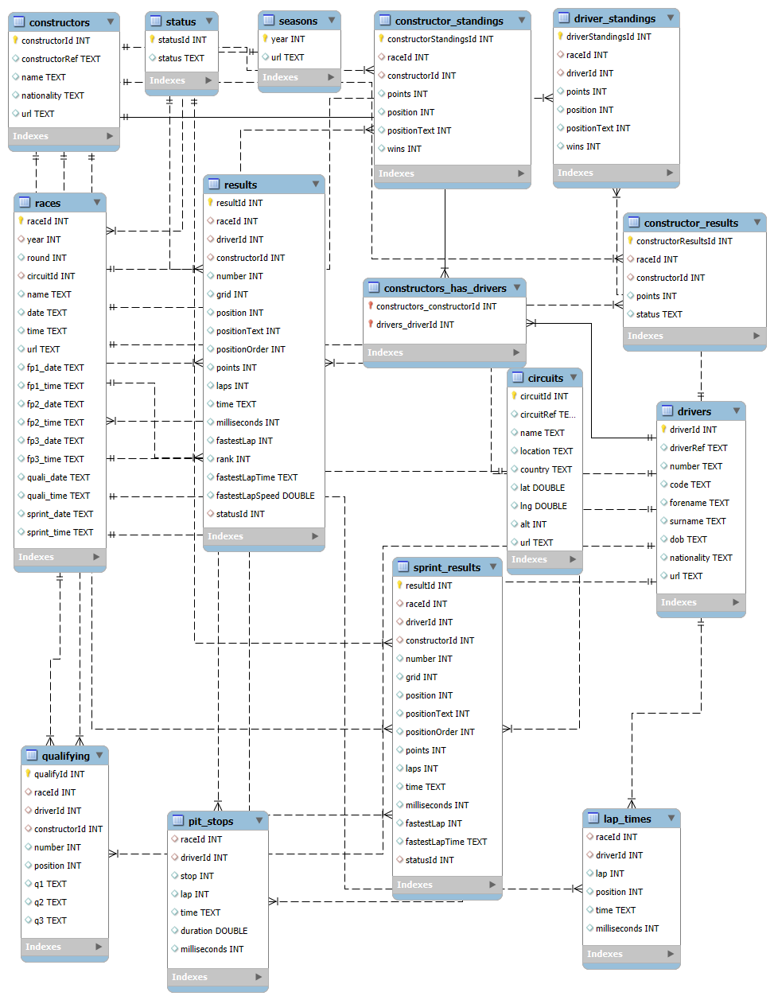

# Formula 1 — SQL Analysis (1950–2024)

**Short:** A collection of 15 practical SQL exercises and polished solutions built on the Formula 1 World Championship dataset (1950–2024).  
**Goal:** Practice and demonstrate end-to-end SQL skills: joins, aggregations, window functions, CTEs, data-cleaning, and modeling for analytical queries.

---

## Repository contents

- `sql/` — All SQL scripts. Each file contains:
  - a short explanation,
  - the production-ready SQL query,
  - minimal notes and caveats.
- `docs/` — Modeling notes.
- `Data/Dataset.md` — instructions to download and prepare the dataset (we don't include raw data).
- `results/` — sample outputs (CSV) generated from the queries (small, optional).

---

## Dataset

Dataset used: *Formula 1 World Championship (1950–2024)* (Kaggle).  
- `Data/Dataset.md`- Get the dataset from the given link.

**Important:** This repository does not contain the raw dataset. You must download CSVs from the provided Kaggle link and import them into a MySQL (or PostgreSQL) instance. See `data/README.md`.

---

## Database Schema
